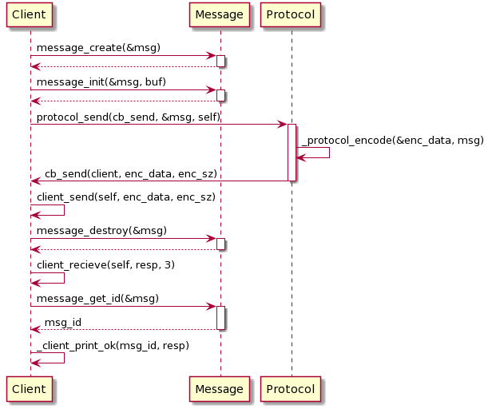
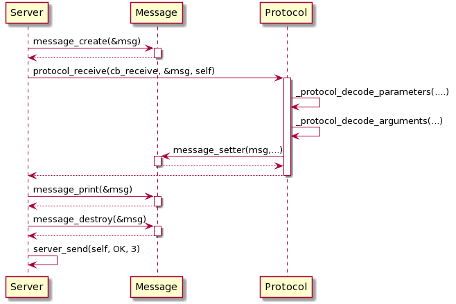

# <u>Trabajo Práctico 1</u>

Alumno: Franco Daniel Schischlo

Padrón: 100615

Repositorio: https://github.com/gdbien/tp1

## <u>Tabla de contenidos</u>
* [Descripción general](#desc)
* [Diagramas UML](#diag)

## <u>Descripción general</u>

La parte compleja y mas central del trabajo práctico era, sin dudas, como se implementaba la comunicación entre el cliente y el servidor de forma protocolada, así que voy a basar mi análisis en las principales estructuras y funciones que aparecen en la resolución del trabajo práctico.

Lo primero a analizar es como uno implementa de forma legible y extensible, un determinado formato de mensaje protocolado (el propuesto por el enunciado), y aquí es cuando surgen las distintas estructuras que voy a mencionar:

```
typedef struct header_pre {
	int8_t endianess;
	int8_t m_type;
	int8_t flags;
	int8_t pro_version;
	int32_t body_size;
	int32_t message_id;
	int32_t arr_size;
} __attribute__((packed)) header_pre_t;
```

```
typedef struct base_param {
	int8_t par_type;
	int8_t byte_1;
	int8_t data_type;
	int8_t null_byte;
} __attribute__((packed)) base_param_t;
```

```
typedef struct norm_param {
	base_param_t base_param;
	int32_t data_size;
} __attribute__((packed)) norm_param_t;
```

```
typedef struct sign_param {
	base_param_t base_param;
	int8_t arg_count;
} __attribute__((packed)) sign_param_t;

```

Todas estas estructuras fueron definidas para que sea mas fácil encodear y desencodear el mensaje, sin tener que estar haciéndolo a "mano", con el cuidado de que todas tienen que tener el atributo packed, para que el compilador no agregue  bytes de padding, y el mensaje resultante tenga la cantidad de bytes esperada.

Las estructuras *_param son utilizadas para llenar el arreglo de parámetros de cada llamada.

Ahora, en cuanto a los distintos valores que pueden tomar los argumentos de las estructuras, estos fueron explícitos utilizando enums, de forma tal de poder referirnos al valor de un atributo por un nombre, y no por un valor numérico suelto.

En cuanto al armado del mensaje encodeado, se resolvió por pasos en la siguiente función:

```
static int _protocol_encode(char **data, message_t *message);
```

Esta función recibe un "char **data", el cual va a quedar finalmente con el "message" (estructura que contiene toda la información ya parseada de un mensaje) encodeado en sí.

Lo primero que hace es crear los parámetros que siempre aparecen en un mensaje, uno por uno, y los va a insertando en un arreglo de parámetros propio, y en el caso de tener un método con argumentos, crea el parámetro firma, lo agrega al arreglo, y crea el body del mensaje. Una vez procesados los parámetros, argumentos, etc, ya se tiene la información necesaria para crear el header_pre, el cual va a contener información útil para luego poder decodificarlo de forma correcta. Por último, se concatenan el header_pre, el arreglo de parámetros, y el body (si es que tiene argumentos el método).

Dado que el proceso del armado del mensaje encodeado era de a partes y de forma incremental, se creó la función;

```
char* array_concat(char *arr1, size_t arr1_size, char *arr2,
				   size_t arr2_size, int32_t *result_size);
```

La que permite ir concatenando bytes, de forma dinámica, sin repetir código (era una operación que se hacía muy seguido).

En cuanto al desencodeo del mensaje, se realiza de a partes utilizando las siguientes funciones:

```
static int _protocol_decode_parameters(const char *encoded_arr, size_t length,
							   		   char *param_names[4], size_t *n_arg);
```

Esta función, como su nombre lo indica, se encarga de obtener los nombres de los distintos parámetros, y los almacena de forma dinámica en param_names. Si bien en _protocol_encode() se creaban los parámetros en su orden de aparición  (que siempre es el mismo; destino, ruta, ...), esta función puede decodificarlos sin importar el orden en el que fue creado el arreglo, dado que primero crea una estructura base_param_t, pregunta por su tipo, y en base a eso, determina que parámetro es y que debe hacer con el.

```
_protocol_decode_arguments(const char *encoded_body, char *arg_names[], size_t n_arg);
```

Se encarga de obtener los nombre de los argumentos (si los hubiese), reservando memoria dinámica para ellos y almacenándolos en arg_names.

## <u>Diagramas UML</u>

### <u>Diagrama de secuencia</u>

Voy a evidenciar el ciclo de envío y recepción de un llamado a método, sin errores, con la impresión del mensaje y respuesta.

Del lado del cliente (simplificado).




La recepción por lado del servidor (no incluí los callbacks a los server_receive para que no quedase muy sobrecargado el diagrama, ya que eran varios)



Si bien en ambos diagramas se exponen como "clases" a los distintos structs client_t, message_t y server_t, no existe un protocol_t, pero se agregó al diagrama para que sea mas visible y fácil de entender.